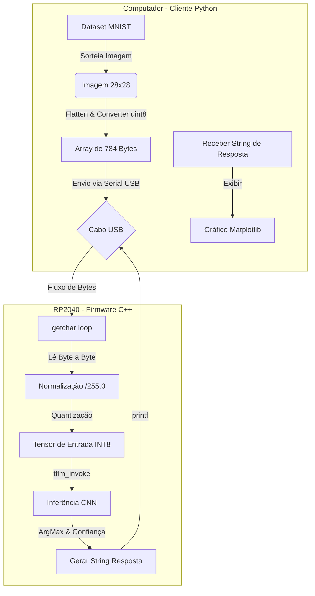

# 🧠 TinyML: Classificação MNIST no RP2040 (BitDogLab)


Este projeto implementa uma solução completa de **TinyML (Machine Learning Embarcado)** para classificação de dígitos manuscritos (Dataset MNIST) utilizando o microcontrolador RP2040 na placa de desenvolvimento BitDogLab.

O sistema recebe imagens enviadas via USB por um script Python, executa a inferência localmente utilizando uma Rede Neural Convolucional (CNN) quantizada (INT8) e retorna a predição em tempo real.

---

## 🏗️ Arquitetura do Sistema

O fluxo de dados consiste no envio de bytes brutos (Raw Bytes) via porta Serial Virtual (USB CDC). O firmware no RP2040 processa os dados utilizando o interpretador TensorFlow Lite Micro.



---

## 📂 Estrutura do Repositório

```text
.
├── CMakeLists.txt              # Configuração de build (Pico SDK + TFLM)
├── classificacao-imagens.c     # Código fonte principal (Main Loop)
├── tflm_wrapper.cpp            # Wrapper C++ para abstração do TFLM
├── tflm_wrapper.h              # Header do wrapper
├── mnist_cnn_int8_model.h      # Modelo treinado convertido em Array C (Hex Dump)
├── pico-tflmicro/              # Submódulo: Biblioteca TensorFlow Lite Micro
└── script-de-envio/            # Cliente Python para testes
    ├── envio-imagem.py         # Script de envio e visualização
    └── requirements.txt        # Dependências Python

```

---

## 🚀 Guia de Instalação e Uso

### Pré-requisitos

* **Hardware:** Placa BitDogLab (RP2040) e Cabo USB.
* **Firmware:** Raspberry Pi Pico SDK, CMake, Compilador `arm-none-eabi-gcc`.
* **Software PC:** Python 3.8+ e VS Code.

### 1. Compilação do Firmware (RP2040)

1. Clone este repositório e certifique-se de baixar os submódulos:
```bash
git clone https://github.com/TorRLD/classificacao-imagens
git submodule update --init --recursive

```


2. Crie a pasta de build e compile:
```bash
mkdir build
cd build
cmake -DPICO_BOARD=pico_w ..
make

```


3. Um arquivo **`classificacao-imagens.uf2`** será gerado.
4. Conecte a placa segurando o botão `BOOT` e copie o arquivo `.uf2` para a unidade montada.

### 2. Execução do Cliente de Teste (Python)

1. Navegue até a pasta de scripts:
```bash
cd script-de-envio

```


2. Instale as bibliotecas necessárias:
```bash
pip install -r requirements.txt

```


*(Conteúdo do requirements.txt: `pyserial`, `numpy`, `tensorflow`, `matplotlib`)*
3. Execute o script:
```bash
python envio-imagem.py

```


4. O script solicitará que pressione `ENTER`. Uma imagem aleatória será enviada para a placa e uma janela gráfica abrirá com o resultado da predição feita pelo RP2040.

---

## ⚙️ Detalhes Técnicos do Modelo

O modelo embarcado foi otimizado para rodar com baixo consumo de memória e latência.

* **Arquitetura:** Convolutional Neural Network (CNN).
* **Camadas:** `Conv2D` → `MaxPooling2D` → `Flatten` → `Dense (Softmax)`.
* **Quantização:** Full Integer Quantization (INT8).
* **Tamanho do Tensor Arena:** 120 KB.

### Operações Suportadas (MicroMutableOpResolver)

Para garantir a execução correta, as seguintes operações foram registradas no firmware:

* `AddConv2D`
* `AddMaxPool2D`
* `AddMean`
* `AddFullyConnected`
* `AddSoftmax`
* `AddReshape`
* `AddQuantize` / `AddDequantize`

---

## 🛠️ Troubleshooting (Solução de Problemas)

| Problema | Possível Causa | Solução |
| --- | --- | --- |
| **Erro "Serial" no Python** | Biblioteca incorreta instalada | `pip uninstall serial` e `pip install pyserial` |
| **Placa não responde** | Buffer Serial dessincronizado | Pressione o botão `RESET` na placa enquanto o script Python estiver rodando |
| **Erro "Didn't find op"** | Operação faltando no Resolver | Verifique se `AddMaxPool2D` está presente no `tflm_wrapper.cpp` |
| **Predições erradas** | Normalização incorreta | Certifique-se de que o Python envia bytes (0-255) e o C divide por 255.0f |

---

## 📜 Licença

Este projeto é de uso acadêmico/educacional.

